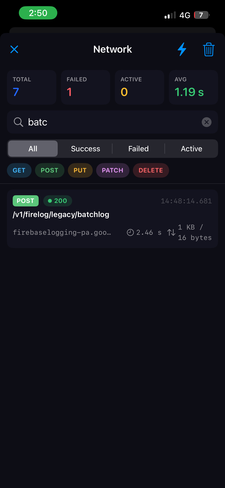
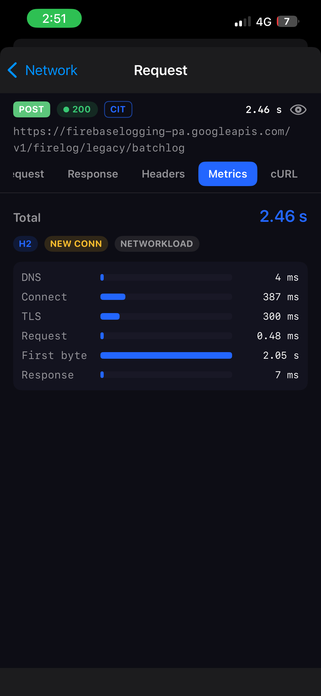
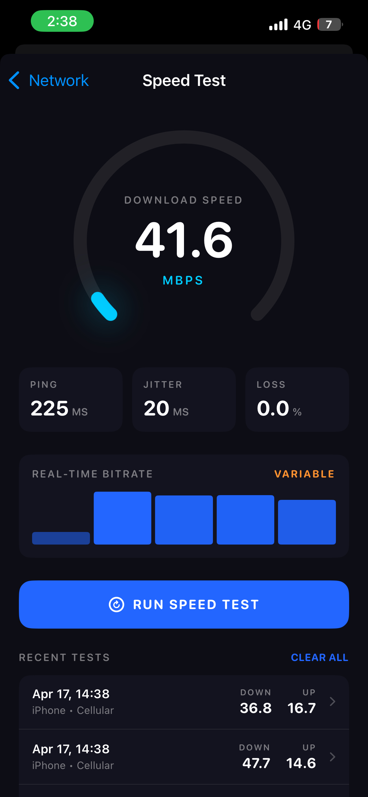

# InspectKit

A zero-dependency, in-process network debugger for iOS. InspectKit intercepts every HTTP/HTTPS request your app makes, captures request/response data, and surfaces it through a floating overlay — with **no changes to your networking code**.

> Designed to be invisible when inactive and non-destructive at all times. Cookies, caches, redirects, and timeouts behave exactly as they would without InspectKit enabled.

---

## Screenshots

<!-- Replace the paths below with your actual screenshot files once you add them to the repo -->

| Dashboard | Request Detail | Speed Test |
|:---------:|:--------------:|:----------:|
|  |  |  |

---

## Features

- **Automatic interception** — Works with `URLSession`, Alamofire, and any library built on top of them. No need to swap out your session or add middleware.
- **Floating bubble overlay** — Draggable, dismissable debug bubble. Fully customisable background colour and icon.
- **Request / Response detail** — URL, method, status, headers, body (JSON pretty-printed, text, binary metadata), timing.
- **Performance timeline** — DNS lookup, TCP connect, TLS handshake, request, response phases per request.
- **Sensitive data redaction** — Passwords, tokens, and auth headers are masked by default. Toggle reveal in the UI with the eye button.
- **Speed Test** — Measure ping, download, and upload speed against Cloudflare's global network, directly from the dashboard.
- **Host filtering** — Whitelist or ignore specific domains.
- **Environment tagging** — Label requests with a build variant (dev / staging / prod).
- **Export** — Copy as cURL or export the full session as JSON.
- **Disk persistence** — Optionally reload the last session across app launches.
- **Zero dependencies** — Pure Swift, no third-party packages.

---

## Requirements

| | Minimum |
|---|---|
| iOS | 13.0 |
| Swift | 5.5 |
| Xcode | 13.0 |

---

## Installation

### Swift Package Manager

**Xcode:** File → Add Package Dependencies → paste the repo URL → select your target.

**`Package.swift`:**
```swift
dependencies: [
    .package(url: "https://github.com/YOUR_USERNAME/InspectKit.git", from: "1.0.0")
],
targets: [
    .target(name: "YourApp", dependencies: ["InspectKit"])
]
```

---

## Quick Start

### AppDelegate

```swift
import InspectKit

func application(
    _ application: UIApplication,
    didFinishLaunchingWithOptions launchOptions: [UIApplication.LaunchOptionsKey: Any]?
) -> Bool {

    #if DEBUG
    InspectKit.shared.configure(
        InspectKitConfiguration(environmentName: "dev")
    )
    InspectKit.shared.start()
    InspectKit.shared.installWindowOverlay(in: window!)
    #endif

    return true
}
```

### SceneDelegate

```swift
import InspectKit

func scene(_ scene: UIScene,
           willConnectTo session: UISceneSession,
           options connectionOptions: UIScene.ConnectionOptions) {
    guard let windowScene = scene as? UIWindowScene else { return }

    #if DEBUG
    InspectKit.shared.configure(
        InspectKitConfiguration(environmentName: "staging")
    )
    InspectKit.shared.start()
    InspectKit.shared.installWindowOverlay(in: windowScene)
    #endif
}
```

### SwiftUI App lifecycle

```swift
import SwiftUI
import InspectKit

@main
struct MyApp: App {
    @UIApplicationDelegateAdaptor(AppDelegate.self) var delegate

    var body: some Scene {
        WindowGroup { ContentView() }
    }
}

class AppDelegate: NSObject, UIApplicationDelegate {
    func application(
        _ application: UIApplication,
        didFinishLaunchingWithOptions launchOptions: [UIApplication.LaunchOptionsKey: Any]? = nil
    ) -> Bool {
        #if DEBUG
        InspectKit.shared.configure(InspectKitConfiguration(environmentName: "dev"))
        InspectKit.shared.start()
        #endif
        return true
    }

    func application(
        _ application: UIApplication,
        configurationForConnecting connectingSceneSession: UISceneSession,
        options: UIScene.ConnectionOptions
    ) -> UISceneConfiguration {
        UISceneConfiguration(name: "Default Configuration", sessionRole: connectingSceneSession.role)
    }
}

// SceneDelegate.swift
import UIKit
import InspectKit

class SceneDelegate: UIResponder, UIWindowSceneDelegate {
    func scene(_ scene: UIScene, willConnectTo session: UISceneSession,
               options: UIScene.ConnectionOptions) {
        guard let windowScene = scene as? UIWindowScene else { return }
        #if DEBUG
        InspectKit.shared.installWindowOverlay(in: windowScene)
        #endif
    }
}
```

---

## URLSession Integration

InspectKit automatically intercepts all sessions via a global swizzle once `start()` is called. No extra work is needed for the shared session or third-party libraries.

If you create a session with a **custom configuration before calling `start()`**, install the protocol explicitly:

```swift
let config = URLSessionConfiguration.default
config.timeoutIntervalForRequest = 30
config.installInspectKit()          // adds InspectKitURLProtocol at index 0

let session = URLSession(configuration: config)
```

Or use the convenience constructor:

```swift
let session = URLSession(
    configuration: InspectKit.shared.makeMonitoredConfiguration()
)
```

---

## Alamofire Integration

The global swizzle covers Alamofire's default `Session` automatically. If you create a **custom Alamofire session**, call `installInspectKit()` on your configuration:

```swift
import Alamofire
import InspectKit

let config = URLSessionConfiguration.default
config.timeoutIntervalForRequest = 30
config.installInspectKit()

let session = Session(configuration: config)
```

If your network layer lives in a **separate module** that doesn't import InspectKit, pass the class reference from your app target:

```swift
// In your app target (imports both):
YourNetworkLayer.shared.debugProtocolClasses = [InspectKit.urlProtocolClass]
```

---

## Bubble Customisation

```swift
// Custom icon, fill content mode, and brand colour
InspectKit.shared.installWindowOverlay(
    in: windowScene,
    customIcon: UIImage(named: "my_logo"),
    imageContentMode: .fill,           // .fit (default) or .fill
    bubbleColor: Color(red: 0.2, green: 0.6, blue: 1.0)
)
```

| Parameter | Type | Default | Description |
|---|---|---|---|
| `customIcon` | `UIImage?` | `nil` | Image inside the bubble. `nil` = default network SF Symbol |
| `imageContentMode` | `ContentMode` | `.fit` | `.fit` keeps full image visible; `.fill` crops to fill the circle |
| `bubbleColor` | `Color?` | `nil` | Solid background colour. `nil` = default blue accent gradient |

---

## Configuration

All options have sensible defaults. Pass only what you need to change.

```swift
let config = InspectKitConfiguration(
    isEnabled: true,

    // Tagging
    environmentName: "dev",             // shown as a badge on each request

    // Filtering
    allowedHosts: ["api.myapp.com"],    // capture ONLY these hosts (empty = all)
    ignoredHosts: ["metrics.io"],       // always skip these hosts

    // Storage
    maxStoredRequests: 500,             // ring-buffer size
    persistToDisk: false,               // reload last session on next launch

    // Capture
    captureRequestBodies: true,
    captureResponseBodies: true,
    captureMetrics: true,
    maxCapturedBodyBytes: 1_000_000,    // 1 MB cap per body

    // UI
    showsFloatingOverlay: true,
    allowsExport: true,

    // Redaction
    redactedHeaderKeys: InspectKitConfiguration.defaultRedactedHeaderKeys,
    redactedBodyKeys: InspectKitConfiguration.defaultRedactedBodyKeys,
    redactionPlaceholder: "██ REDACTED ██"
)
```

### Default Redaction Rules

These keys are masked automatically in the dashboard and in all exports.

**Headers** (case-insensitive):
`Authorization` · `Cookie` · `Set-Cookie` · `X-API-Key` · `API-Key` · `Proxy-Authorization` · `X-Auth-Token`

**JSON body / query params** (case-insensitive, recursive):
`password` · `token` · `access_token` · `refresh_token` · `secret` · `client_secret` · `api_key` · `apikey`

To disable redaction entirely:
```swift
InspectKitConfiguration(
    redactedHeaderKeys: [],
    redactedBodyKeys: []
)
```

To add your own keys:
```swift
InspectKitConfiguration(
    redactedBodyKeys: InspectKitConfiguration.defaultRedactedBodyKeys
        .union(["ssn", "credit_card", "cvv"])
)
```

The in-app dashboard shows redacted values by default. Tap the **eye icon** in a request's header to reveal sensitive data for that request.

---

## Dashboard

Tap the floating bubble to open the inspector. From there:

| Tab | What you see |
|---|---|
| **Overview** | URL, method, status, timing, size, query params |
| **Request** | Request headers + body |
| **Response** | Response headers + body |
| **Headers** | All headers in one place, redacted values highlighted |
| **Metrics** | DNS, TCP, TLS, request, response timing breakdown |
| **cURL** | Reproducible cURL command, ready to copy |

Search and filter requests by text, state (all / active / completed / failed) or HTTP method.

The **⚡ Speed Test** button in the top-right corner opens the connection speed tester.

---

## Speed Test

Tap **⚡** in the dashboard nav bar to open the speed test screen.

InspectKit measures three values against Cloudflare's global network:

| Metric | How it's measured |
|---|---|
| **Ping** | Average of 3 × round-trip HEAD requests |
| **Download** | 10 MB GET — bytes received ÷ elapsed time |
| **Upload** | 2 MB POST — bytes sent ÷ elapsed time |

Results are colour-coded: **green** ≥ 20 Mb/s · **orange** 5–20 Mb/s · **red** < 5 Mb/s (ping: green < 50 ms · orange < 100 ms).

Speed test requests are excluded from the request list — they don't pollute your captured session data.

---

## Export

```swift
// Single request as cURL (redacted)
let curl = InspectKit.shared.curl(for: record)

// Full session as a JSON Data blob
let data = try InspectKit.shared.exportSessionJSON()

// Full session written to a temp file (for UIActivityViewController)
let url = try InspectKit.shared.exportSessionFile()
present(UIActivityViewController(activityItems: [url], applicationActivities: nil), animated: true)
```

---

## Programmatic Access

```swift
// All captured records (most recent first)
let records = InspectKit.shared.store.records

// Filter failed requests
let failures = records.filter { $0.isFailure }

// Look at a specific request
if let record = records.first {
    print(record.urlString)
    print(record.statusCode ?? 0)
    print(record.durationMS ?? 0, "ms")
}

// Clear the store
InspectKit.shared.clear()
```

---

## Present the Dashboard Manually

If you prefer to open the inspector via your own debug menu instead of the bubble:

```swift
// Remove the floating bubble
InspectKit.shared.removeWindowOverlay()

// Present the dashboard from any view controller
InspectKit.shared.present(from: self)
```

---

## Debug-Only Usage (Recommended)

InspectKit should never be active in App Store / production builds. The safest pattern:

```swift
#if DEBUG
InspectKit.shared.configure(InspectKitConfiguration(isEnabled: true))
InspectKit.shared.start()
#endif
```

You can also gate on a runtime flag without removing call sites:

```swift
InspectKit.shared.configure(
    InspectKitConfiguration(isEnabled: ProcessInfo.processInfo.environment["INSPECT"] == "1")
)
InspectKit.shared.start()  // no-op if isEnabled is false
```

---

## Known Limitations

- **SSL pinning**: Apps that implement certificate pinning in their own `URLSessionDelegate` cannot have that behaviour replicated inside InspectKit's forwarding session. Pinned endpoints are handled using the system trust chain. This is intentional — InspectKit is a debug tool, not a proxy.
- **WebSocket**: `URLSessionWebSocketTask` is not intercepted.
- **Background sessions**: `URLSessionConfiguration.background(_:)` tasks are not captured.
- **Download tasks to file**: `URLSessionDownloadTask` results are forwarded correctly but the body is captured in memory up to the `maxCapturedBodyBytes` limit.

---

## License

MIT — see [LICENSE](LICENSE).
