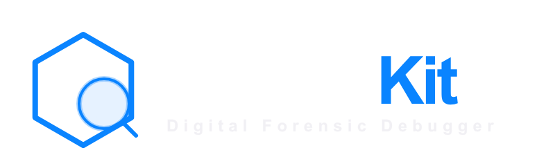

<div align="center">
  

  
  
  
  
</div>

A zero-dependency iOS debug toolkit with two independent products:

| Product | Purpose |
|---|---|
| **InspectKit** | Network inspector — intercepts every HTTP/HTTPS request and surfaces it in a floating dashboard |
| **InspectKitMock** | Network mocker — intercepts selected requests and returns configurable fake responses, errors, or delays |

Use either product alone or both together. No changes to your networking code required.

---

## Screenshots

| Dashboard | Request Detail | Speed Test |
|:---------:|:--------------:|:----------:|
|  |  |  |

---

## Requirements

| | Minimum |
|---|---|
| iOS | 13.0 |
| Swift | 5.5 |
| Xcode | 13.0 |

---

## Installation

### Swift Package Manager

**Xcode:** File → Add Package Dependencies → paste the repo URL.  
Then add **InspectKit**, **InspectKitMock**, or both to your target.

**`Package.swift`:**
```swift
dependencies: [
    .package(url: "https://github.com/Mahmoud3allam/InspectKit.git", from: "1.0.0")
],
targets: [
    .target(
        name: "YourApp",
        dependencies: [
            "InspectKit",     // inspector only
            "InspectKitMock", // mocker only  — or add both
        ]
    )
]
```

---

## InspectKit — Network Inspector

### Quick Start

#### AppDelegate
```swift
import InspectKit

func application(_ application: UIApplication,
                 didFinishLaunchingWithOptions launchOptions: [UIApplication.LaunchOptionsKey: Any]?) -> Bool {
    #if DEBUG
    InspectKit.shared.configure(InspectKitConfiguration(environmentName: "dev"))
    InspectKit.shared.start()
    InspectKit.shared.installWindowOverlay(in: window!)
    #endif
    return true
}
```

#### SceneDelegate
```swift
import InspectKit

func scene(_ scene: UIScene, willConnectTo session: UISceneSession,
           options connectionOptions: UIScene.ConnectionOptions) {
    guard let windowScene = scene as? UIWindowScene else { return }
    #if DEBUG
    InspectKit.shared.configure(InspectKitConfiguration(environmentName: "staging"))
    InspectKit.shared.start()
    InspectKit.shared.installWindowOverlay(in: windowScene)
    #endif
}
```

#### SwiftUI App lifecycle
```swift
import SwiftUI
import InspectKit

@main
struct MyApp: App {
    @UIApplicationDelegateAdaptor(AppDelegate.self) var delegate
    var body: some Scene { WindowGroup { ContentView() } }
}

class AppDelegate: NSObject, UIApplicationDelegate {
    func application(_ application: UIApplication,
                     didFinishLaunchingWithOptions launchOptions: [UIApplication.LaunchOptionsKey: Any]? = nil) -> Bool {
        #if DEBUG
        InspectKit.shared.configure(InspectKitConfiguration(environmentName: "dev"))
        InspectKit.shared.start()
        #endif
        return true
    }
}

// SceneDelegate.swift
class SceneDelegate: UIResponder, UIWindowSceneDelegate {
    func scene(_ scene: UIScene, willConnectTo session: UISceneSession,
               options connectionOptions: UIScene.ConnectionOptions) {
        guard let windowScene = scene as? UIWindowScene else { return }
        #if DEBUG
        InspectKit.shared.installWindowOverlay(in: windowScene)
        #endif
    }
}
```

### Features

- **Automatic interception** — Works with `URLSession`, Alamofire, and any library built on top of them. No need to swap out your session or add middleware.
- **Floating bubble overlay** — Draggable, dismissable debug bubble. Fully customisable background colour and icon.
- **Request / Response detail** — URL, method, status, headers, body (JSON pretty-printed, text, binary metadata), timing.
- **Performance timeline** — DNS lookup, TCP connect, TLS handshake, request, response phases per request.
- **Sensitive data redaction** — Passwords, tokens, and auth headers are masked by default.
- **Speed Test** — Measure ping, download, and upload speed directly from the dashboard.
- **Host filtering** — Whitelist or ignore specific domains.
- **Environment tagging** — Label requests with a build variant (dev / staging / prod).
- **Export** — Copy as cURL or export the full session as JSON.
- **Disk persistence** — Optionally reload the last session across app launches.
- **MOCKED pill** — When used alongside InspectKitMock, intercepted requests show a cyan **MOCKED** badge in the list.

### URLSession Integration

InspectKit automatically intercepts all sessions via a global swizzle once `start()` is called. No extra work needed for the shared session or third-party libraries.

If you create a session with a custom configuration before calling `start()`:

```swift
let config = URLSessionConfiguration.default
config.installInspectKit()   // inserts InspectKitURLProtocol at index 0

let session = URLSession(configuration: config)
```

Or use the convenience constructor:
```swift
let session = URLSession(
    configuration: InspectKit.shared.makeMonitoredConfiguration()
)
```

### Alamofire Integration

The global swizzle covers Alamofire's default `Session` automatically. For a custom Alamofire session:

```swift
import Alamofire
import InspectKit

let config = URLSessionConfiguration.default
config.installInspectKit()

let session = Session(configuration: config)
```

If your network layer lives in a **separate module** that doesn't import InspectKit:

```swift
// In your app target (imports both):
YourNetworkLayer.shared.debugProtocolClasses = [InspectKit.urlProtocolClass]
```

### Bubble Customisation

```swift
InspectKit.shared.installWindowOverlay(
    in: windowScene,
    customIcon: UIImage(named: "my_logo"),
    imageContentMode: .fill,
    bubbleColor: Color(red: 0.2, green: 0.6, blue: 1.0)
)
```

| Parameter | Type | Default | Description |
|---|---|---|---|
| `customIcon` | `UIImage?` | `nil` | Image inside the bubble. `nil` = default network SF Symbol |
| `imageContentMode` | `ContentMode` | `.fit` | `.fit` keeps full image visible; `.fill` crops to fill the circle |
| `bubbleColor` | `Color?` | `nil` | Solid background colour. `nil` = default blue accent gradient |

### Configuration

```swift
let config = InspectKitConfiguration(
    isEnabled: true,
    environmentName: "dev",

    // Filtering
    allowedHosts: ["api.myapp.com"],   // capture ONLY these hosts (empty = all)
    ignoredHosts: ["metrics.io"],      // always skip these hosts

    // Storage
    maxStoredRequests: 500,
    persistToDisk: false,

    // Capture
    captureRequestBodies: true,
    captureResponseBodies: true,
    captureMetrics: true,
    maxCapturedBodyBytes: 1_000_000,   // 1 MB cap per body

    // Redaction
    redactedHeaderKeys: InspectKitConfiguration.defaultRedactedHeaderKeys,
    redactedBodyKeys: InspectKitConfiguration.defaultRedactedBodyKeys,
    redactionPlaceholder: "██ REDACTED ██"
)
```

**Default redacted headers:** `Authorization` · `Cookie` · `Set-Cookie` · `X-API-Key` · `X-Auth-Token`  
**Default redacted body keys:** `password` · `token` · `access_token` · `refresh_token` · `secret` · `api_key`

### Dashboard

Tap the floating bubble to open the inspector:

| Tab | What you see |
|---|---|
| **Overview** | URL, method, status, timing, size, query params |
| **Request** | Request headers + body |
| **Response** | Response headers + body |
| **Headers** | All headers in one place, redacted values highlighted |
| **Metrics** | DNS, TCP, TLS, request, response timing breakdown |
| **cURL** | Reproducible cURL command, ready to copy |

### Speed Test

Tap **⚡** in the dashboard nav bar. Measures ping, download, and upload against Cloudflare's global network.

| Metric | How |
|---|---|
| **Ping** | Average of 3 × round-trip HEAD requests |
| **Download** | 10 MB GET — bytes received ÷ elapsed time |
| **Upload** | 2 MB POST — bytes sent ÷ elapsed time |

### Export

```swift
let curl = InspectKit.shared.curl(for: record)
let data = try InspectKit.shared.exportSessionJSON()
let url  = try InspectKit.shared.exportSessionFile()
present(UIActivityViewController(activityItems: [url], applicationActivities: nil), animated: true)
```

### Programmatic Access

```swift
let records  = InspectKit.shared.store.records
let failures = records.filter { $0.isFailure }

if let record = records.first {
    print(record.urlString, record.statusCode ?? 0, record.durationMS ?? 0)
}

InspectKit.shared.clear()
```

### Present the Dashboard Manually

```swift
InspectKit.shared.removeWindowOverlay()
InspectKit.shared.present(from: self)
```

---

## InspectKitMock — Network Mocker

InspectKitMock intercepts selected network requests and returns configurable fake responses, errors, or delays — so you can test loading states, error screens, empty states, and timeouts without depending on a real backend.

### Quick Start

#### SwiftUI

```swift
import InspectKitMock

// 1. Start the mocker (AppDelegate / @main)
InspectKitMock.shared.start()

// 2. Create a rule
let rule = MockRule(
    name: "Fake login",
    matcher: RequestMatcher(path: .contains("/login"), method: .POST),
    response: MockResponse(kind: .ok(
        statusCode: 200,
        headers: ["Content-Type": "application/json"],
        body: .json(#"{"token":"fake-token","user":"demo"}"#)
    )),
    delay: 0.5   // simulate 500 ms network latency
)

// 3. Register the rule
InspectKitMock.shared.store.add(rule)

// 4. Attach the dashboard to your root view
ContentView().inspectKitMock()
```

#### UIKit

```swift
import InspectKitMock

// AppDelegate
func application(_ application: UIApplication,
                 didFinishLaunchingWithOptions launchOptions: [UIApplication.LaunchOptionsKey: Any]?) -> Bool {
    #if DEBUG
    InspectKitMock.shared.start()
    // optionally seed rules here
    #endif
    return true
}

// Open dashboard from any UIViewController (shake gesture, debug button, etc.)
InspectKitMock.shared.presentDashboard(from: self)
```

All requests that **don't match** any rule are forwarded to the real network unchanged (`passThroughOnMiss: true` by default).

### Features

- **Rule-based matching** — match by host, path, HTTP method, query params, headers, and body content.
- **String match modes** — `equals`, `contains`, `prefix`, `suffix`, `regex` for every field.
- **Response types** — success (custom status code, headers, body) or network error (domain + code).
- **Body formats** — `none`, `text`, `json` (validated), `data`, or a bundle file.
- **Artificial delay** — 0–10 s slider per rule to simulate slow connections.
- **Scenarios** — group rules into named sets; activate one scenario at a time.
- **Hit log** — rolling list of the last 100 matched requests.
- **Persistence** — rules and scenarios survive app restarts via UserDefaults JSON.
- **InspectKit integration** — when both are running, mocked requests appear in the Inspector list with a cyan **MOCKED** pill.

### Matching Rules

```swift
// Match any POST to a path containing "/login"
RequestMatcher(path: .contains("/login"), method: .POST)

// Match requests to a specific host
RequestMatcher(host: .equals("api.example.com"))

// Match by regex path
RequestMatcher(path: .regex("^/users/\\d+$"))

// Match a specific query parameter value
RequestMatcher(query: ["page": .equals("1")])

// Match if the request body contains a string
RequestMatcher(bodyContains: "grant_type")
```

### Response Types

```swift
// Success response with JSON body
MockResponse(kind: .ok(
    statusCode: 200,
    headers: ["Content-Type": "application/json"],
    body: .json(#"{"items":[]}"#)
))

// Success with plain text
MockResponse(kind: .ok(
    statusCode: 204,
    headers: [:],
    body: .none
))

// Simulate a timeout
MockResponse(kind: .failure(
    domain: NSURLErrorDomain,
    code: NSURLErrorTimedOut,
    userInfo: [:]
))

// Simulate an HTTP 500
MockResponse(kind: .ok(statusCode: 500, headers: [:], body: .text("Internal Server Error")))

// Load body from a bundle file
MockResponse(kind: .ok(
    statusCode: 200,
    headers: ["Content-Type": "application/json"],
    body: .bundleFile(name: "mock_feed", ext: "json")
))
```

### Scenarios

Group rules into a named scenario and activate it to test a specific app state:

```swift
// All rules in the store
let errorRuleID   = errorRule.id
let emptyRuleID   = emptyFeedRule.id

let loginErrors = MockScenario(
    name: "Login errors",
    ruleIDs: [errorRuleID]
)
InspectKitMock.shared.store.addScenario(loginErrors)
InspectKitMock.shared.store.activateScenario(id: loginErrors.id)
// Only errorRule matches now; emptyFeedRule is ignored
```

Deactivate to return to all-rules mode:
```swift
InspectKitMock.shared.store.deactivateAllScenarios()
```

### Configuration

```swift
InspectKitMock.shared.configure(MockConfiguration(
    isEnabled: true,
    passThroughOnMiss: true,     // unmatched requests → real network (default)
    logToInspectKit: true,       // show mocked requests in InspectKit dashboard
    persistenceKeyPrefix: "InspectKitMock"
))
```

### Using Both Together

#### SwiftUI

```swift
import InspectKit
import InspectKitMock

// AppDelegate / @main
#if DEBUG
InspectKit.shared.configure(InspectKitConfiguration(environmentName: "dev"))
InspectKit.shared.start()
InspectKitMock.shared.start()
#endif

// Root view — attach both dashboards
ContentView()
    .inspectKit()
    .inspectKitMock()
```

#### UIKit

```swift
import InspectKit
import InspectKitMock

// AppDelegate
#if DEBUG
InspectKit.shared.configure(InspectKitConfiguration(environmentName: "dev"))
InspectKit.shared.start()
InspectKitMock.shared.start()
#endif

// SceneDelegate — Inspector floating bubble
func scene(_ scene: UIScene, willConnectTo session: UISceneSession,
           options connectionOptions: UIScene.ConnectionOptions) {
    guard let windowScene = scene as? UIWindowScene else { return }
    #if DEBUG
    InspectKit.shared.installWindowOverlay(in: windowScene)
    #endif
}

// Open the mock dashboard from any view controller
InspectKitMock.shared.presentDashboard(from: self)
```

Mock intercepts matching requests first (higher swizzle priority). Unmatched requests fall through to InspectKit's capture layer and then to the real network.

### In-App Dashboard

#### SwiftUI

Attach `.inspectKitMock()` to your root view:

```swift
ContentView().inspectKitMock()
```

Open programmatically (e.g. from a shake gesture):
```swift
InspectKitMock.shared.presentDashboard()
```

#### UIKit

Call `presentDashboard(from:)` with any `UIViewController`:

```swift
// e.g. from a shake gesture override
override func motionEnded(_ motion: UIEvent.EventSubtype, with event: UIEvent?) {
    if motion == .motionShake {
        InspectKitMock.shared.presentDashboard(from: self)
    }
}

// or from a debug button
@IBAction func showMockDashboard(_ sender: Any) {
    InspectKitMock.shared.presentDashboard(from: self)
}
```

The dashboard shows:

- **Summary bar** — total rules, enabled rules, hit count, active scenario
- **Rule list** — enable/disable toggle, method badge, status code, hit count, delay indicator
- **Rule editor** — create and edit rules with match fields, response builder, and delay slider
- **Scenarios** — create named groups, activate with one tap
- **Hit log** — reverse-chronological list of matched requests with method, URL, status, and timestamp

---

## Debug-Only Usage (Recommended)

Both products should be inactive in App Store builds:

```swift
#if DEBUG
InspectKit.shared.configure(InspectKitConfiguration(isEnabled: true))
InspectKit.shared.start()

InspectKitMock.shared.start()
#endif
```

Or gate on a runtime environment variable without removing call sites:
```swift
let enabled = ProcessInfo.processInfo.environment["MOCK"] == "1"
InspectKitMock.shared.configure(MockConfiguration(isEnabled: enabled))
InspectKitMock.shared.start()   // no-op if isEnabled is false
```

---

## Known Limitations

- **SSL pinning**: Apps that implement certificate pinning in their own `URLSessionDelegate` are unaffected; InspectKit uses the system trust chain.
- **WebSocket**: `URLSessionWebSocketTask` is not intercepted by either product.
- **Background sessions**: `URLSessionConfiguration.background(_:)` tasks are not captured.
- **Download tasks**: `URLSessionDownloadTask` results are forwarded correctly but the body is captured in memory up to `maxCapturedBodyBytes`.
- **InspectKitMock**: Does not mock WebSocket, SSE, or background sessions.

---

## License

MIT — see [LICENSE](LICENSE).

---

## Created by

**Mahmoud Allam**
